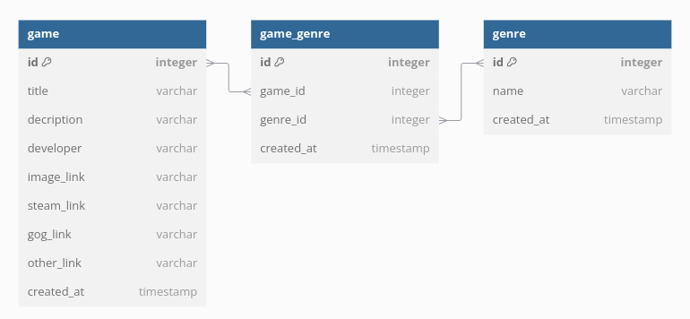

# Inventory Application

This is an inventory management app project which I built as part of [The Odin Project](https://www.theodinproject.com/) Node.js curriculum for learning purposes where users can add and see some games. The project is hosted on render https://inventory-application-yk0z.onrender.com

## Technologies


## Features

Any user can add games, add genres, see all games, search for a game or see a specific game, but only users with a secret password defined on .env can delete a game or a genre.

## Project Structure

### Database

There is a **many-to-many** relationship between games and genres, which uses game_genre junction table.



### Folder structure

```bash
.
├── controllers
│   ├── gameController.js
│   ├── genreController.js
│   └── indexController.js
├── db
│   ├── gameQueries.js
│   ├── genreQueries.js
│   ├── pool.js
│   └── populatedb.js
├── docs
│   └── db-structure.png
├── errors
│   └── NotFoundError.js
├── middlewares
│   ├── validateGame.js
│   └── validateGenre.js
├── public
│   ├── images
│   │   └── placeholder-image.jpg
│   ├── scripts
│   │   ├── form.js
│   │   ├── game.js
│   │   └── genre.js
│   └── styles
│       ├── 404.css
│       ├── base.css
│       ├── form.css
│       ├── game.css
│       ├── gamelist.css
│       ├── genre.css
│       └── homepage.css
├── routes
│   ├── gameRouter.js
│   ├── genreRouter.js
│   └── indexRouter.js
├── views
│   ├── components
│   │   ├── card.ejs
│   │   ├── footer.ejs
│   │   ├── header.ejs
│   │   └── search.ejs
│   ├── 404.ejs
│   ├── form.ejs
│   ├── game.ejs
│   ├── gamelist.ejs
│   ├── genre.ejs
│   └── homepage.ejs
├── app.js
├── package.json
├── package-lock.json
└── README.md
```

## What I learned

<ul>
    <li>Improved my knowledgment on backend and MVC pattern;</li>
    <li>Improved my knowledgment on relational database usage;</li>
    <li>Practiced new CSS features like nesting;</li>
    <li>Learned how to handle a many-to-many relationship on databases.</li>
</ul>

## Issues/Todos

<ul>
    <li>
        URL patterns aren't friendly, it would be better to use 
        <a href="https://developer.mozilla.org/en-US/docs/Glossary/Slug">slugs</a> 
        with better routes;
    </li>
    <li>Image links from user input aren't checked on backend for a valid image source;</li>
    <li>The CSS and Views files are messed up;</li>
    <li>Performance wasn't a concern.</li>
</ul>
